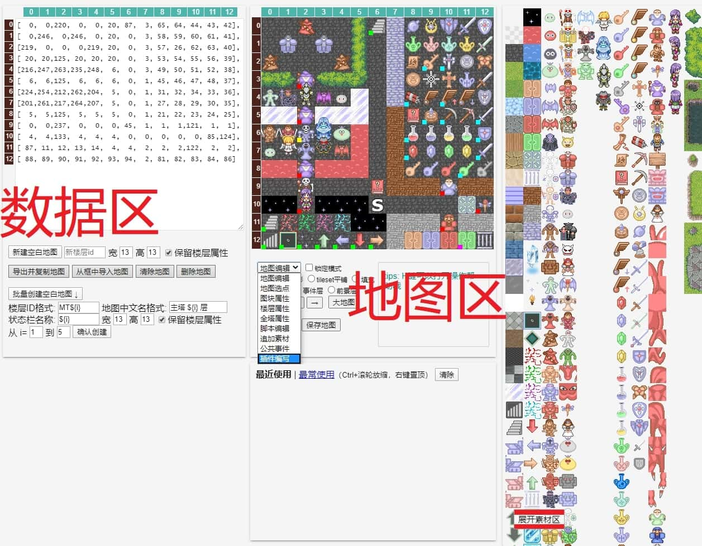
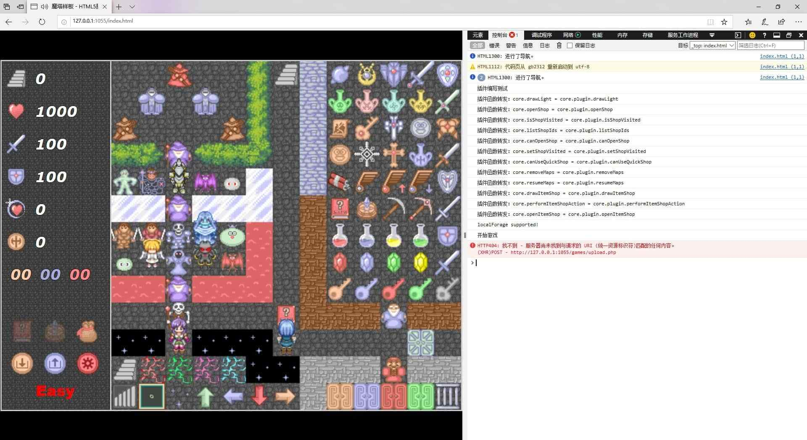

# 快速上手

?> 在这一节中，将详细介绍做一部塔的流程。现在，让我们来做一部单层塔！

## 前置需求
你需要满足如下条件才能进行制作：[样板下载地址](https://github.com/ckcz123/mota-js/releases)。
1.  操作系统：
    -   Win8或更高版本，Win7则需要安装 .Net Framework
        4.0（能打开根目录的“启动服务.exe”即可）
    -   其他电脑则需安装[python
        3.8.3](https://www.python.org/downloads/)或更高版本，能运行根目录的server.py即可（Windows也可以这样做）。
    -   安卓手机需要安装[HTML5安卓造塔器](http://h5mota.com/games/_client/H5motaMaker.apk)，推荐搭配ES文件浏览器。
2.  [chrome浏览器](http://google.cn/chrome)：其他浏览器可能导致本地服务闪退。
3.  （强烈推荐）[VScode](http://code.visualstudio.com/download)：最适合HTML5项目的文本编辑器，能进行跨文件的正则搜索和替换，也能完整发挥根目录的runtime.d.ts文件的作用。

只要满足了上述条件，你就可以开始做自己的塔啦！

## 启动HTTP服务

与编辑器闭源的RPG Maker MV不同，本样板对文件的绝大部分修改是通过网页编辑器经由本地HTTP服务完成的，这样做也有助于编辑器跨平台并最大限度地复用运行时代码，还可以让玩家在在线游戏时查看游戏工程。

在根目录下有一个“启动服务.exe”，运行之。（非Windows电脑则需使用命令行运行server.py，安卓手机则使用造塔器）


* 启动游戏：打开[http://127.0.0.1:1055/index.html](http://127.0.0.1:1055/index.html)，同时开启多个启动服务则1056、1057顺延（下同）。你能在里面看到现在游戏的效果。
* 地图编辑器：打开[http://127.0.0.1:1055/editor.html](http://127.0.0.1:1055/editor.html)（竖屏则为editor-mobile.html），这是您整个制作流程的核心页面

以下为Windows专用的一些辅助工具（位于“辅助工具”文件夹），由C#编写：

* 便捷PS工具：能方便地替换和新增素材。
* 地图生成器：识别RPG Maker魔塔的地图截图，生成HTML5魔塔的地图数据。
* 怪物数据导出：从RPG Maker XP 1.03游戏导出怪物数据，用于HTML5魔塔或使用excel查看。
* RM动画导出：从RPG Maker XP 1.03游戏导出动画，用于HTML5魔塔。
* JS代码压缩：对js代码和音像素材（背景音乐除外）进行压缩，从而减小文件体积，加快在线游戏的加载。
* 额外素材合并：将`project\tilesets`文件夹中的图片中用到的图块重新拼成更少的图片，并更新对应的地图矩阵。
* 动画编辑器：编辑`project\animates`文件夹中的动画文件，或利用图片制作全新的动画。
* 伤害和临界值计算器、帮助文档：如题，后者会打开本文档。

!> **整个造塔过程中，启动服务必须全程处于开启状态！切不可手滑关闭，否则做的都是无用功！**

## 编辑器页面的结构



如上图，编辑器页面的结构分为三大部分。左边叫**数据区**，中央叫**地图区**，右侧叫**素材区**，竖屏状态下同时只能显示其中一个，需要经常来回切换。

请尤其注意中央下方的下拉框，您可以随时按下Z、X、…、句号键（字母键第三行）让数据区在这些模式之间切换。更多键鼠快捷操作请按下H键查看，这里列出一部分：
1.  **Alt+0~9、0~9：**给素材区的图块绑定数字快捷键，并使用。（您也可以用中央下方的“最近/最常使用图块”和置顶来代替）
2.  **WASD、或单击/长按四个箭头按钮：**滚动大地图，还可以单击“大地图”按钮观看全景。
3.  **Ctrl+W/A/S/Z/X/C/V/Y：**关闭、全选、保存、撤销、剪切、复制、粘贴、重做绘图等操作。
4.  **PageUp/PageDown或滚轮：**切换楼层。
5.  **ESC、Delete：**取消选中并保存、删除选中点的图块和事件。（需要保存时“保存地图”按钮也会变色提示）
6.  **地图上单击、双击、右击：**地图选点、选中该点的素材并自动定位到素材区、弹出菜单（您可以进行出生点、机关门、上下楼的快速绑定等操作）
7.  **地图上左键或右键拖动：**交换两个点的图块和事件、框选一些点供Ctrl+X/C/V剪切复制。
8.  **素材区最右侧的tileset区域左键拖动：**框选一批素材，供在地图区单击批量绘制或左键拖动平铺。
9.  **事件编辑器中Ctrl+S/Z/X/C/V/Y、右击、双击等：**执行相应操作，如双击可以进入多行编辑或UI绘制预览。

## 快速上手

针对红海塔作者，这里给出一个极简版的造塔流程，您可以据此造出一座没有任何事件（包括但不限于难度分歧、老人、木牌、商人和商店等）的塔：
1.  编辑勇士的出生点和初始属性：
    1.  滚轮切换到主塔0层，右击地图任意位置，绑定出生点为此点（会有一个大大的白色S字母显示出来）。
    2.  按下B键切换到“全塔属性”，填写core.firstData.hero中勇士的各项初始属性，以及一些全局的数值（如四种血瓶和三种宝石的效果、破甲反击净化的比例等，注意“唯一英文标识符”一定要修改！）。
    3.  在数据区使用滚轮向下翻（您可以随时折叠全塔属性的几大部分），按需编辑下面的大量勾选框（主要就是状态栏的那些显示项）。
2.  从素材区选择各种各样的非NPC图块绘制在地图上，如门、怪物、道具、楼梯、路障、箭头、踩灯、箱子等。每当选中一个素材时，数据区就进入了“图块属性”模式，您可以去填写道具的一些说明、以及修改其他一些图块的可通行性等。注意滑冰（触发器为ski）要画在背景层。如果您需要制作机关门，请简单地将机关门和守卫（不支持阻击怪和炸弹）画在地图上，再右击机关门快速绑定即可。（看到机关门左下角出现橙色小方块、守卫们左下角出现黄色小方块即说明绑定成功）
3.  如果您需要制作多个楼层，只需按下Z键将数据区切换到“地图编辑”模式，然后“新建空白地图”即可，不同楼层之间简单地通过楼梯来往返，您可以将楼梯画在地图上再右击快速绑定即可。（看到楼梯左下角出现绿色小方块即说明绑定成功）各个楼层的属性可以通过按下V键将数据区切换到“楼层属性”模式来填写，如能否使用楼传、是否为地下层、画面色调、宝石血瓶倍率等。
4.  从素材区选择您所使用的各种怪物，在数据区填写它们的各项属性，其中“特殊属性”是通过多选框来编辑的。
5.  游戏胜利的触发：滚轮切换到样板1层，单击地图上的公主，按下Ctrl+C复制。滚轮切换回您的boss层，（记得给boss设置不可被炸哦）单击boss身后的任何一个空格子，按下Ctrl+V粘贴即可。这样玩家触碰到公主游戏就会胜利。

## 控制台调试



HTML5项目都是可以进行控制台调试的，下面以edge浏览器为例介绍其部分操作：

首先按下F12键（部分键盘没有此键或需与Fn键一起按）或Ctrl+Shift+I，打开开发人员界面。

可以看到它分为“元素”、“控制台”、“调试程序”、“性能”等多个部分：
1.  **元素：**您可以在这里对游戏和编辑器的各HTML和css元素进行查看和临时的修改，譬如您想观察游戏在竖屏的表现，只需将窗口拉到瘦高。
2.  **性能：**您可以在这里对游戏的任何一段脚本进行性能分析，观察其中各行的执行频率和耗时，从而确定优化的方向。
3.  **调试程序：**您可以在这里查看游戏的源码，包括project文件夹的functions.js和plugin.js（脚本编辑和插件编写）以及整个libs文件夹，并进行断点调试。
4.  **控制台：**最常使用的部分，当编辑器或游戏打不开、卡死、或者不按您的预想运作时您就需要查看这里的报错信息。这里也是各种API输入的地方，譬如上图中您可以看到全部的插件函数。这里介绍几个最基本的命令，更多通用命令请前往[菜鸟教程](http://www.runoob.com/js)或[w3school](http://w3school.com.cn/js/index.asp)学习，更多样板API请查阅runtime.d.ts（这是个文本文件，不是音频。手机打不开的话请将后缀名改为txt）。
``` js
    alert('Hello world!'); // 弹窗警告，请勿放在正常游戏流程中可以触发的地方
    console.log('Hello world'); // 在控制台打印一条信息，可用于游戏流程的任何部分
    Math.floor(3.2); // 执行一个数学函数计算，计算不大于某数的最大整数
    // 以上是所有网页通用的命令，下面介绍HTML5魔塔样板特有的API. 样板API都是以core.xxx开头的，比如：
    core.material; // 查看游戏的所有元件（只读），如动画、音频、图片、道具和怪物等
    core.status; // 查看游戏的所有状态，其中又以core.status.hero为核心
    core.getItem('yellowKey', 3); // 获得3把黄钥匙，有获得提示并播放音效
```

更多关于控制台调试和脚本的信息可参见[脚本](script)和[API列表](api)。

==========================================================================================

[继续阅读下一章：元件说明](element)
