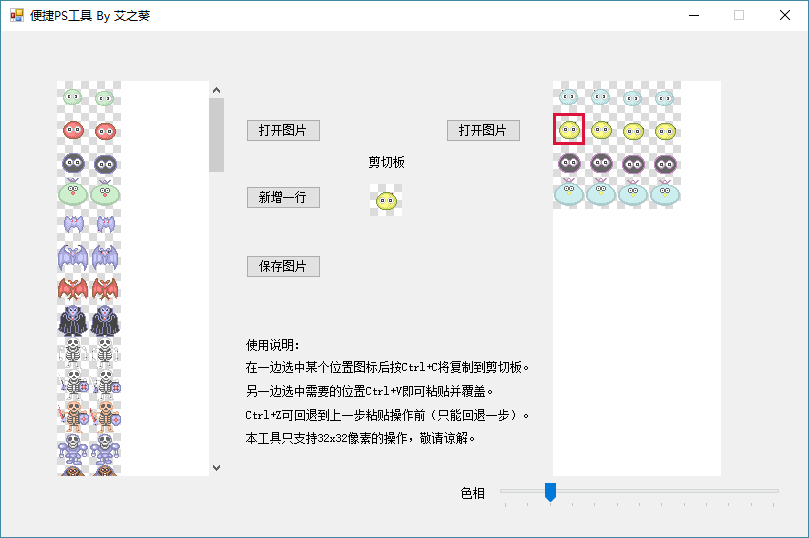

# 个性化

有时候只靠样板本身可能是不够的。我们需要一些个性化、自定义的素材，道具效果，怪物属性，等等。

## 自定义素材

所有素材的图片都在`images`目录下。
- `animates.png` 为所有动画效果。主要是星空熔岩，开门，毒网，传送门之类的效果。为四帧。
- `autotile.png` 为Autotile块。全塔只支持一种Autotile，其ID为20。
- `enemys.png` 为所有怪物的图片。其对应的数字，从上至下依次是会从201开始计算（即，绿色史莱姆为201，小蝙蝠为205，依次类推）。请注意，动画效果为两帧，一般是原始四帧中的1和3。（四帧中12相同，34相同，因此只取1和3即可）
- `heros.png` 为勇士行走图。
- `items.png` 为所有道具的图标。
- `npcs.png` 为所有NPC的图标，也是两帧。
- `terrains.png` 为所有地形的图标。

系统会读取`icon.js`文件，并获取每个ID对应的图标所在的位置。

### 使用预定义的素材

在images目录的“默认素材”下给定了若干预定义的自定义素材。包括野外（草地），星空，木板等等都已经被预先给定。

如果你需要某个素材已经存在，则可以直接将其覆盖images目录下的同名文件，就能看到效果。

### 使用便捷PS工具生成素材

如果我们有更多的素材要求，我们可以使用“便捷PS工具”进行处理。



我们可以打开有需求改变的素材，和我们需要被替换的素材，然后简单的Ctrl+C和Ctrl+V操作即可。

用这种方式，我们能极快地替换或素材，包括需要新增的怪物。

### 添加素材到游戏

在使用地图编辑器编辑的过程中，我们有可能会出现“该数字和ID未被定义”的错误提示。

这是因为，该素材没有被定义，无法被游戏所识别。

#### 新添加自定义地形（路面、墙壁等）

如果你在terrains.png中新增了一行：

1. 指定一个唯一的英文ID，不能和terrains中现有的重复。
2. 进入icons.js，在terrains分类下进行添加（对应图标在图片上的位置，即index）
3. 指定一个数字，在maps.js的getBlock下类似进行添加。
``` js
if (id == 13) tmp.event = {'cls': 'animates', 'id': 'weakNet', 'noPass': false, 'trigger': 'passNet'}; // 衰网
if (id == 14) tmp.event = {'cls': 'animates', 'id': 'curseNet', 'noPass': false, 'trigger': 'passNet'}; // 咒网
if (id == 15) tmp.event = {'cls': 'animates', 'id': 'water', 'noPass': true}; // 水
// 可以在此处类似添加数字-ID对应关系，但不能和任何已有的数字重复
// autotile: 20
if (id == 20) tmp.event = {'cls': 'autotile', 'id': 'autotile', 'noPass': true}; // autotile
``` 

#### 新添加道具

如果你需要新增一个未被定义的道具：

1. 指定一个唯一的英文ID，不能和items中现有的重复。
2. 进入icons.js，在items分类下进行添加（对应图标在图片上的位置，即index）
3. 指定一个数字，在maps.js的getBlock下类似进行添加。
4. 在items.js中仿照其他道具，来添加道具的信息。

``` js
if (id == 63) tmp.event = {'cls': 'items', 'id': 'moneyPocket'} // 金钱袋
if (id == 64) tmp.event = {'cls': 'items', 'id': 'shoes'} // 绿鞋
if (id == 65) tmp.event = {'cls': 'items', 'id': 'hammer'} // 圣锤
// 可以在这里添加自己的数字-ID对应关系，但不能和任何已有的数字重复
``` 

有关如何自行实现一个道具的效果，参见[自定义道具效果](#自定义道具效果)。

#### 新添加怪物

如果我们需要新添加怪物，请在enemys.png中新增一行，然后复制粘贴上四帧怪物图的**1和3帧**。

然后执行如下操作：

1. 指定一个唯一的英文ID，不能和enemys中现有的重复。
2. 进入icons.js，在enemys分类下进行添加（对应图标在图片上的位置，即index）
3. 在maps.js的getBlock下继续进行添加。请注意其ID为200开始的顺序，即如果新增一行为261，依次类推
4. 在enemys.js中仿照其他怪物，来添加怪物的信息。

``` js
if (id == 258) tmp.event = {'cls': 'enemys', 'id': 'octopus'};
if (id == 259) tmp.event = {'cls': 'enemys', 'id': 'fairy'};
if (id == 260) tmp.event = {'cls': 'enemys', 'id': 'greenKnight'};
// 在此依次添加，数字要求是递增的
```

有关如何自行实现一个怪物的特殊属性或伤害计算公式，参见[怪物的特殊属性](#怪物的特殊属性)。

#### 新添加NPC

类似同上，给NPC指定ID，在icons.js中指定ID-index关系，在maps.js中指定ID-数字的关系，即可。

### 地图生成器使用自定义素材

地图生成器是直接从js文件中读取数字-图标对应关系的。

因此，在你修改了icons.js和maps.js两个文件，也就是将素材添加到游戏后，地图生成器的对应关系也将同步更新。

## 自定义道具效果

本节中将继续介绍如何自己编辑一个道具的效果。

道具效果的具体实现都在`items.js`中。

### 即捡即用类道具（cls: items）

对于即捡即用类道具，如宝石、血瓶、剑盾等，我们可以简单地修改`data.js`中的value一栏即可。

如果你有更高级的需求（例如每个区域的效果不同），则需要编辑`items.js`文件。具体方式是：

1. 找到`getItemEffect`函数；所有即捡即用类道具的效果都在这里实现。
2. 算道具效果系数，或应该增加的值。
``` js
items.prototype.getItemEffect = function(itemId, itemNum) {
    var itemCls = core.material.items[itemId].cls;
    // 消耗品
    if (itemCls === 'items') {
        var floor = parseInt(core.status.thisMap.name); // 获得当前楼层。此name和剧本中的name完全一致。
        var ratio = 1; // 道具效果系数
        if (floor>=11 && floor<=20 ) ratio = 2; // 11-20F（二区），道具效果翻倍
        if (floor>=21 && floor<=30 ) ratio = 3; // 21-30F（二区），道具效果三倍
        // ... 根据自己的需要来写
        
        if (itemId === 'redJewel') core.status.hero.atk += core.values.redJewel * ratio; // 将初始效果乘以倍数
        if (itemId === 'blueJewel') core.status.hero.def += core.values.blueJewel * ratio; // 将初始效果乘以倍数
        if (itemId === 'greenJewel') core.status.hero.mdef += core.values.greenJewel * ratio; // 将初始效果乘以倍数
        if (itemId == 'yellowJewel') { // 黄宝石属性：需自己定义
// ... 下略
```
3. 修改同样修改下面的`getItemEffectTip`函数，使提示文字相应变动。

!> **请注意这里`core.status.thisMap.name`获取的是当前层中，你在剧本文件里写的name那一项（即状态栏中的层数显示）。然后可以通过几个简单的if来判断应该增加的值。**

### 消耗类道具（cls: tools）；永久类道具（cls: constants）

如果要自己实现消耗类道具或永久类道具的使用效果，则需修改`items.js`中的canUseItem和useItem两个函数。

具体过程比较复杂，需要一定的JS能力，在这里就不多说了，有需求可以找`艾之葵`进行了解。

但值得一提的是，我们可以使用`core.hasItem(name)` 来判断是否某个道具是否存在。例如下面是passNet（通过路障处理）的一部分：

``` js
/****** 经过路障 ******/
events.prototype.passNet = function (data) {
    // 有鞋子
    if (core.hasItem('shoes')) return;
    if (data.event.id=='lavaNet') { // 血网
// ... 下略
```

我们进行了一个简单的判断，如果拥有绿鞋，则不进行任何路障的处理。

### 实战！拿到神圣盾后免疫吸血、领域、夹击效果

1. 在getItemEffect中修改拿到神圣盾时的效果，标记一个自定义Flag。
``` js
if (itemId === 'shield5') {
    core.status.hero.def += core.values.shield5;
    core.setFlag("shield5", true); // 增加一个自定义Flag：已经拿到神圣盾
}
```
2. 免疫吸血效果：在`enemys.js`的getExtraDamage函数中，编辑成如果存在神圣盾标记，额外伤害为0。
``` js
enemys.prototype.getExtraDamage = function (monster) {
    var extra_damage = 0;
    if (this.hasSpecial(monster.special, 11)) { // 吸血
        // 吸血的比例
        extra_damage = core.status.hero.hp * monster.value;
        if (core.hasFlag("shield5")) extra_damage = 0; // 如果存在神圣盾，则免疫吸血
        extra_damage = parseInt(extra_damage);
    }
// ... 下略
```
3. 免疫领域、夹击效果：在`core.js`中，找到updateCheckBlock函数，并编辑成如果有神圣盾标记，则直接返回。
``` js
// 更新领域、显伤点
core.prototype.updateCheckBlock = function() {
    if (!core.isset(core.status.thisMap)) return;
    if (!core.isset(core.status.checkBlockMap)) core.updateCheckBlockMap();
    core.status.checkBlock = [];
    if (core.hasItem('shield5')) return; // 如拥有神圣盾则直接返回
    for (var x=0;x<13;x++) {
        for (var y=0;y<13;y++) {
            // 计算(x,y)点伤害
            var damage = 0;
// ... 下略
```
4. 如果有更高的需求，例如想让吸血效果变成一半（如异空间），则还是在上面这些地方进行对应的修改即可。

## 自定义怪物属性

如果你对现有的怪物不满意，想自行添加怪物属性（例如让怪物拥有双属性乃至更多属性），也是可以的。具体参见`enemys.js`文件。

你需自己指定一个special数字，修改getSpecialText函数。

如果要修改伤害计算公式，请修改下面的calDamage函数。请注意，如果无法战斗，该函数必须返回`999999999`。

因此无敌属性可以这样设置：

先给无敌属性指定一个数字，例如18，在getSpecialText中定义

``` js
// ... 上略
    if (this.hasSpecial(special, 15)) text.push("领域");
    if (this.hasSpecial(special, 16)) text.push("夹击");
    if (this.hasSpecial(special, 17)) text.push("仇恨");
    if (this.hasSpecial(special, 18)) text.push("无敌"); // 添加无敌的显示
    return text.join("  ");
}

```

然后修改calDamage，如果无敌属性且勇士没有拥有十字架，则立刻返回无穷大。

``` js
enemys.prototype.calDamage = function (hero_atk, hero_def, hero_mdef, mon_hp, mon_atk, mon_def, mon_special) {
    if (this.hasSpecial(mon_special, 18) && !core.hasItem("cross")) // 如果是无敌属性，且勇士未持有十字架
        return 999999999; // 返回无限大

    // 魔攻
    if (this.hasSpecial(mon_special, 2)) hero_def = 0;
// ... 下略
```

对于吸血怪的额外伤害计算在getExtraDamage中。

对于毒衰弱怪物的战斗后结算在`events.js`中的afterBattle函数中。

对于领域、夹击怪物的检查在`events.js`中的checkBlock函数中。

`getCritical`, `getCriticalDamage`和`getDefDamage`三个函数依次计算的是该怪物的临界值、临界减伤和1防减伤。也可以适当进行修改。

## 根据难度分歧来自定义地图

遗憾的是，所有地图数据必须在剧本的map中指定，换句话说，我们无法在游戏进行中动态修改地图，比如为简单难度增加一个血瓶。

幸运的是，我们可以采用如下方式进行难度分歧，为用户简单难度下增加额外的血瓶或宝石。

``` js
"firstArrive": [ // 第一次到该楼层触发的事件
    {"type": "if", "condition": "flag:hard!=3", // 判断是否困难难度
        "true": [ // 不为困难，则为普通或简单难度
            {"type": "show", "loc": [3,6]} // 显示血瓶
            {"type": "if", "condition": "flag:hard==1", // 判断是否是简单难度
                "true": [
                    {"type": "show", "loc": [3,7]} // 简单难度则显示宝石
                ],
                "false": [] // 普通难度则只显示血瓶
            },
        ],
        "false": [] // 困难难度，不进行任何操作
  },
],
"events": {
  "3,6": {"enable": false} // 比如[3,6]点是一个血瓶，初始不可见
  "3,7": {"enable": false} // 比如[3,7]点是一个宝石，初始不可见
}
```

如上所示，我们在地图上设置一个额外的血瓶和宝石，并初始时设为禁用状态。

当第一次到达该楼层时，进行一次判断；如果不为困难难度，则将血瓶显示出来；再判断是否为简单难度，如果是则再把宝石显示出来。

通过对`flag:hard`进行判断的方式，我们也可以达成“对于不同的难度有着不同的地图效果”。

==========================================================================================

[继续阅读附录：所有API列表](api)
