# 快速上手

?> 上次更新时间：* {docsify-updated} *

在这一节中，将详细介绍做一部塔的流程。现在，让我们来做一部单层塔！

## 前置需求

你需要有满足如下条件才能进行制作：

- Windows 8以上操作系统；Windows 7需要安装.Net Framework 4.0。（能打开同目录下的“启动服务.exe”即可）
- 任一款现代浏览器。强烈推荐Chrome。
- 一个很好的文本编辑器。推荐带有高亮染色、错误提示等效果。例如：WebStorm，VSCode，或者至少也要Sublime Text。
  - （[VSCode下载地址](https://code.visualstudio.com/)，群里的群文件中也有，强烈推荐之。）

只要满足了上述条件，你就可以开始做自己的塔啦！

## 启动HTTP服务

在根目录下有一个“启动服务.exe”，运行之。

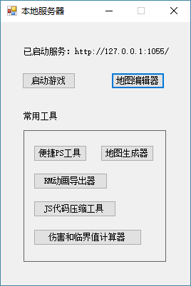

* “启动游戏”按钮将打开一个网页，你能在里面看到现在游戏的效果。
* “地图编辑器”允许你以可视化的方式进行编辑地图。
* “便捷PS工具”能让你很方便的对自定义素材进行添加。参见[自定义素材](personalization#自定义素材)。
* “地图生成器”能让你从已有的截图（如RMXP项目）中立刻生成可被本样板识别的地图数据。
* “JS代码压缩工具”能对JS代码进行压缩，从而减少IO请求数和文件大小。
* “伤害和临界值计算器”是一个很便捷的小工具，能对怪物的伤害和临界值进行计算。

## 新建剧本

类似于RMXP，本塔每层楼都是一个“剧本”，剧本内主要定义了本层的地图和各种事件。主函数将读取每个剧本，并生成实际的地图供游戏使用。

我们打开 `libs/floors/` 目录，这个目录是所有剧本的目录。我们需要指定一个楼层名，例如MT1；然后，我们可以将`MT0.js`（模板）复制重命名为为`MT1.js`，并使用文本编辑器打开。

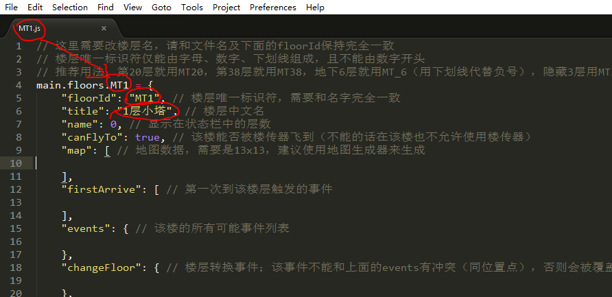

然后将楼层名改为MT1，floorId改名为MT1；title可以改成任意内容，将在切换楼层时进行显示（比如可以改成“1层小塔”）。

具体样板文件的每个要素如下：
- **`floorId`** 楼层唯一标识符；必须和文件名，以及 `main.floors.xxx` 完全一致
- **`title`** 楼层中文名，将在切换楼层时进行显示
- **`canFlyTo`** 当前楼层可否被楼传器飞到。如果该层不能飞到，则也在该层也不允许使用楼传器。
- **`canUseQuickShop`** 当前楼层可否使用快捷商店。
- **`defaultGround`** 该层的背景（地面）素材。需要是在`icon.js`里`terrains`中定义的一个ID，如`ground`, `grass2`等等。
- **`color`** 该层的画面色调。本项可选，如果不写则色调为默认值（无色调），否则是一个RGBA数组，比如`[255,0,0,0.3]`等。
- **`bgm`** 到达该层后默认播放的BGM。本项可忽略。
- **`map`** 本层地图，需要是13x13数组，建议使用地图生成器或者可视化地图编辑器制作。
- **`firstArrive`** 第一次到该楼层触发的事件
- **`events`** 该楼的所有可能事件列表
- **`changeFloor`** 楼层转换事件；该事件不能和上面的events有冲突（同位置点），否则会被覆盖
- **`afterBattle`** 战斗后可能触发的事件列表
- **`afterGetItem`** 获得道具后可能触发的事件列表
- **`afterOpenDoor`** 开完门后可能触发的事件列表

我们最终的任务其实是，将每个楼层的剧本（地图&事件）给写完即可。

换句话说，只需要简单的复制操作，我们就可以新建一个剧本了。

## 绘制地图

有两种绘制地图的方式：从头绘制地图；从RMXP中导入已有的地图。

### 从头绘制地图

我们直接打开“地图编辑器”，可以看到一个可视化的UI界面。

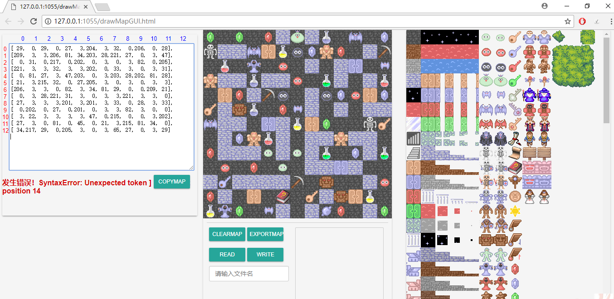

然后可以在上面任意进行绘制地图。

!> **如果地图的数字和ID未被定义，则会进行提示：数字和ID未被定义！此时可能需要手动在icons.js和maps.js中定义对应的数字和ID。请参见[自定义素材](personalization#自定义素材)。**

绘制地图完毕后，点击"导出地图"，即可在左边看到对应的JSON数组，并且已经复制到了剪切板。将其粘贴到剧本中的map位置即可。

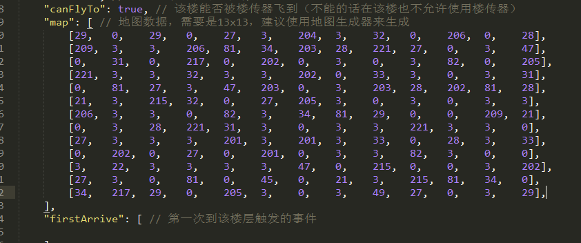

### 从RMXP导入已有的地图

如果我们想复刻一个现有的，已经被RMXP所制作的塔，也有很便捷的方式，那就是用到我们的“地图生成器”。

首先，我们打开RMXP和对应的项目，可以看到它的地图。

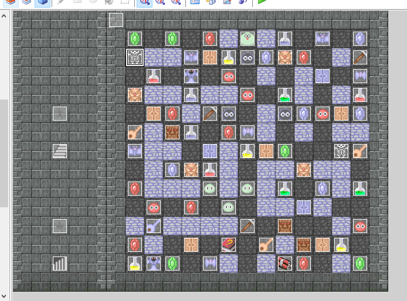

我们打开Windows自带的“截图工具”，并将整个地图有效区域截图下来，并将其复制到剪切板。

截图时请注意：**只截取有效游戏空间内数据，并且有效空间内的范围必须是13x13。（如果地图小于13*13，请用星空或墙壁填充到13x13）。**

确认地图的图片文件已经复制到剪切板后，我们打开“地图生成器”，并点“加载图片”。大约1-2秒后，可以得到地图的数据。

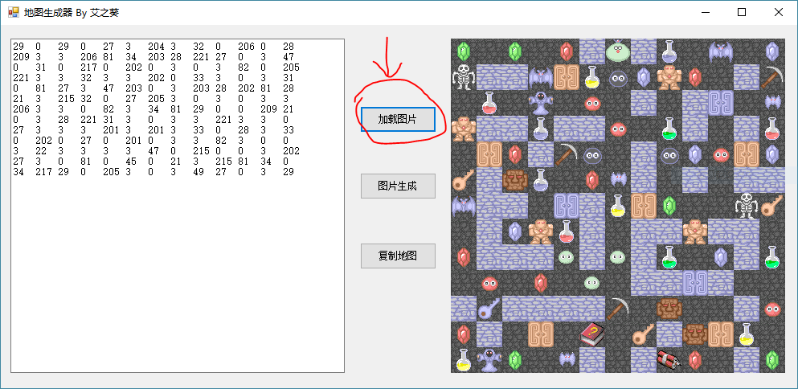

然后点击“复制地图”，即可将地图数据复制到剪切板。

!> **如果有识别不一致的存在，即生成的地图和实际的地图不符，我们可以在地图编辑器中粘贴，再可视化进行编辑。**

!> **地图生成器默认只支持经典素材。如果有自定义素材需求（例如原版的1层小塔那种素材），请参见[自定义素材](personalization#自定义素材)。**  

!> **请确保截图范围刚好为13x13，并且保证每个位置的像素都是32x32。**

## 录入数据

有了地图后，我们下一步需要做的就是录入数据。数据主要包括如下几种：

- 勇士初始的属性
- 全局变量（宝石效果、全局Flag等）
- 怪物数据（每个怪物的攻防血金币经验等等）

下面依次进行说明。

我们打开`data.js`文件，这里面定义了各种全局属性和勇士初始值。

我们可以将本塔标题改名为“1层小塔”，

游戏的唯一标识符叫onefloor，然后可以直接修改勇士的各项初始数据.

!> **注：name作为游戏的唯一标识符必须进行修改，否则可能会导致存档等出现问题。**

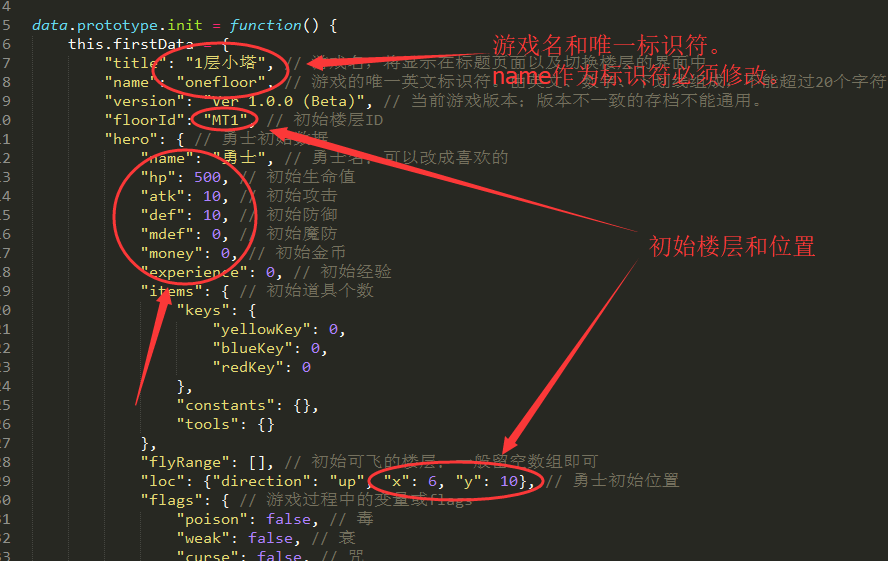

!> **请注意，勇士的初始位置一栏，x为横坐标，y为纵坐标；即，x为从左到右第几列，y为从上到下第几行，均从0开始计算。**

修改完初始化信息后，接下来我们需要修改道具的信息（比如宝石加攻防的数值，血瓶加生命的数值等）。还是在这个`data.js`文件，往下拉，找到values一项，并进行相应的设置

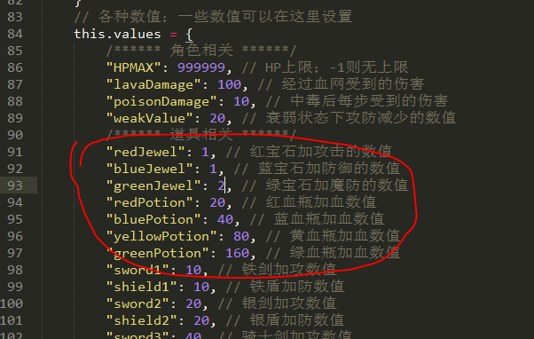

然后，再设置一些系统Flag，以进行游戏。继续将`data.js`往下拉，我们注意到本塔是存在魔防的，不存在经验，因此我们可以简单地将enableMDef改为true，enableExperience改成false，enableDebuff改成false。

同理，本塔的破墙镐只能破面前的墙壁，因此`pickaxeFourDirections`需要改成`false`。

其他的几项暂时不会被涉及到，因此不用考虑。

全局变量修改完毕后，我们需要告诉主函数加载该楼层。打开`main.js`（该文件和index.html同级），找到`this.floorIds`项，将其值改为楼层ID即MT1。

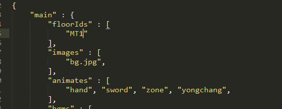

最后一步就是录入怪物数据。打开`enemys.js`文件，依次输入你在本塔内使用到的所有怪物的攻防血的数据。其中怪物的特殊属性（special项）与该文件下面的getSpecialText对应。

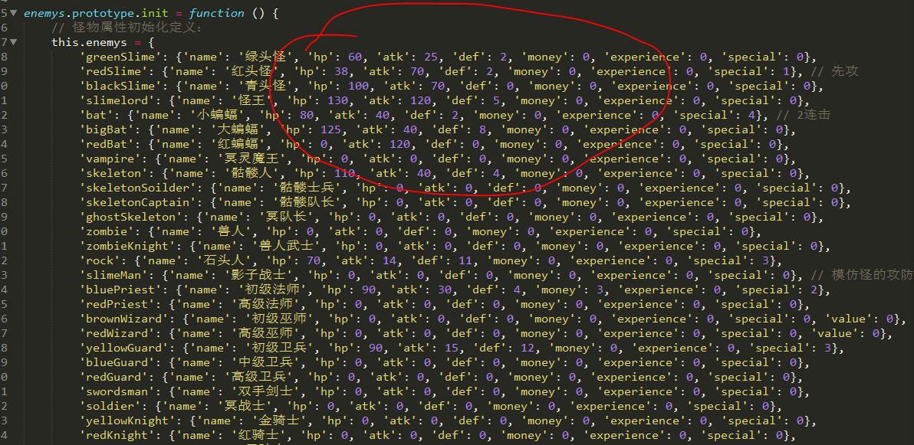

只需要修改自己用到的怪物属性即可，其他没有用到的怪物完全无所谓。

做完后保存所有文件，然后右键，选择使用chrome浏览器打开`index.html`，就能立刻看到自己的塔并开始游戏啦！是不是很简单呢！

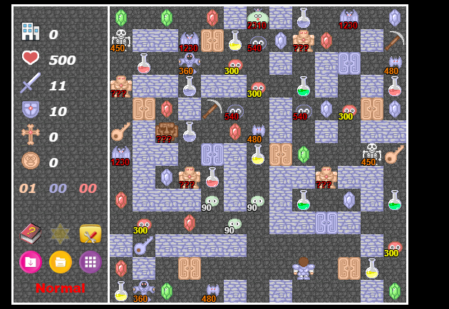

## 压缩与发布

当你将上述步骤完成后，你实际上已经做出来了一个魔塔，并且可以发布给大家进行游戏了。
目前而言发布有如下几种方式：

- 离线版本：直接将游戏文件夹打包，放到百度网盘等地方供用户下载；用户下载到本地后直接使用浏览器打开`index.html`进行游戏。
  - 手机端的部分浏览器如chrome也支持本地网页，可以下载到手机然后直接打开进行游戏。
- 在线版本：将游戏放到某个服务器上，大家在线联网游戏。

**离线版本的好处是：先全部下载后再游戏，无需考虑流量的问题，也可以支持高清音乐的播放。坏处是：没办法在多平台之间迁移，无法及时获得游戏更新（需要重新下载），而浏览器打开本地文件有丢失存档的风险。  
在线版本的好处是：随时随地可以玩，可以多平台接档，还可以在后台看到一些统计信息，可以随时对游戏进行更新；坏处是需要一个服务器，且还要考虑到用户流量的问题。**

在此我们只讨论在线版本。当你决定发布游戏时，强烈建议先将JS代码进行压缩以节省可能的IO请求以及网络流量。直接打开同目录下的“JS代码压缩工具”进行压缩即可。

压缩完毕后，你还需要将`main.js`中的useCompress从false改为true，这样方才只会加载压缩后的文件。

如果你需要发布到服务器上且你没有服务器，可以直接将本塔发给我（`艾之葵`），我会给负责你部署上去的。我的服务器至少能保证两年内有效。

然后就是发布帖子、链接二维码，能让任何人在任何时候任何平台上都能进行游戏啦！是不是很简单呢！

## 注意事项和常见FAQ

1. 截图请务必刚好截取13x13的图片，并需要保证每个位置必须为32x32像素。一般无放缩的RMXP符合条件。
2. 游戏的唯一标识符name请务必修改。如果不修改可能会导致存档出现异常。
3. 别忘了main.js中要修改floorIds指明所用到的所有楼层哦~

下面是几个常见的FAQ：

**Q: 为什么截图识别不出来？**

**A:** 请保证刚好为13x13，且每个位置必须32x32像素。如果不确定，可以保存你的截图，右键属性查看详细信息，看像素的宽高是不是在416左右。多少几十像素都是没关系的。

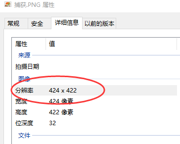

**Q: 打开游戏时卡死在了xxx.js加载完毕！无法进入游戏。**

**A:** 最大的可能是因为少了逗号，或者反括号等等。一般而言VSCode都会有错误提示，你哪里少了东西。

如果没有，可以采用如下方式debug：

Ctrl+Shift+I 打开Chrome的控制台，找到Console。

如果出现了语法错误，会有红色提示 **Unexpected xxx** ，找到后面文件名和行号，打开，使用VSCode检查该处是否存在问题，即可。

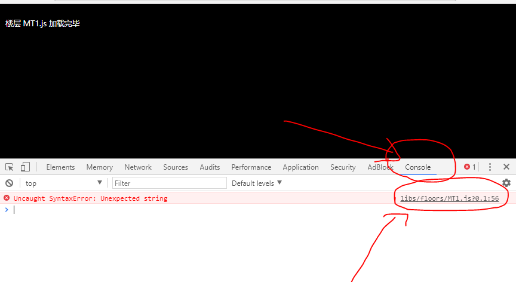

==========================================================================================

[继续阅读下一章：元件说明](element)